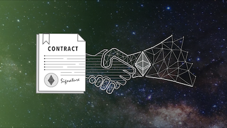

## Build Ethereum From Scratch - Smart Contracts and More

This repository accompanies the "Build Ethereum From Scratch - Smart Contracts and More"
course by David Katz.

#### Take the course here:

[https://www.udemy.com/build-ethereum-from-scratch?couponCode=GITHUB](https://www.udemy.com/build-ethereum-from-scratch?couponCode=GITHUB)

In the course, you will build your own version of Ethereum. Ethereum can be described in two words. It's a:

#### Decentralized Computer.

A decentralized computer is like a normal computer. A normal computer executes a program using one machine.

But a decentralized computer executes a program using multiple machines. Every machine needs to agree upon the output of the program for its results to become official.

To build a decentralized computer, here are the essential elements:

1) A smart contract language.
2) A blockchain.
3) A network.
4) Transactions and accounts.
5) A state management data structure.

Definitely take the course if you're interested in exploring the concepts behind this project more deeply. The course is a line-by-line tutorial of this entire repository. And by the end of the course, you'll have your own version of Ethereum.